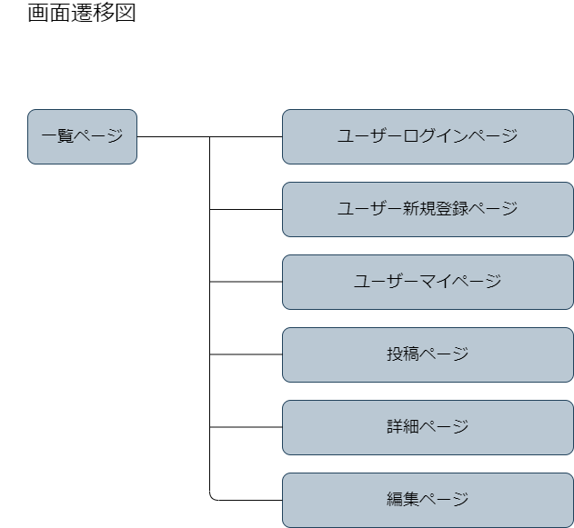

# アプリケーション名
Treino

# アプリケーション概要
サッカー練習投稿アプリ。練習内容を動画投稿し、改善点などコメントを得ることでサッカー上達ができます。

# URL
https://oriapp-wm2h.onrender.com/

# テスト用アカウント
* メールアドレス：test@test.com
* パスワード：iwanoda

# 利用方法
練習投稿
* 新規登録でユーザー登録をします。
* 投稿画面でタイトル、動画、内容を記述して投稿します。

コメント投稿
* 一覧画面から投稿内容の詳細を確認します。
* 詳細画面から動画に対してコメントをします。

# アプリケーションを作成した背景
まずは私自身がサッカーをやっていることと、上達するために練習管理や自己管理をするのが難しいと感じていました。チーム練習管理アプリなどは世の中にあるようですが、個人の練習管理アプリは良さそうなものは見当たりませんでした。また、ユーザーの母数がチームでは少なくなりますが個人なら多いと思います。特に小中学生でチーム練習以外に個人練習をして上達したい子供は世の中に多くいると思いますが、個人で練習管理を行うのは難しいです。また、チーム練習時にコーチからアドバイスをもらえるのは限られているので、いつでもすぐにアドバイスが欲しいという要望も叶えられます。

# 洗い出した要件
https://docs.google.com/spreadsheets/d/1vfLZTyBiRKjhlaMQEvD0oOXUjoyrqAOo/edit#gid=1517943354

# 実装した機能についての画像やGIFおよびその説明

動画を投稿できる機能を実装しました。
またコメント機能も実装済みです。

# 実装予定の機能
目標管理機能を実装したいと考えております。
練習スケジュール機能も実装したいと考えております。
また、目標と練習スケジュールを紐づけるような機能も実装したいと考えております。
さらに、練習によって自身のステータス変動機能も実装したいと考えております。

# データベース設計

# 画面遷移図

# 開発環境
* フロントエンド
* バックエンド
* インフラ
* テキストエディタ
* タスク管理

# ローカルでの動作方法
以下のコマンドを順に実行。
% git clone https://github.com/seiji-nagano/OriApp.git
% cd seiji-nagano/OriApp.git
% bundle install
% yarn install

# 工夫したポイント
* 企画と要件定義
ITとスポーツを繋いで、スポーツを発展させるような役割を担うアプリケーションを開発したいと考えました。
その中で自分にとって一番身近なサッカーを取り上げました。
世の中にまだ出回っていないアプリケーションを企画することができました。また、ユーザーの母数が多い個人を対象とすることを選択しました。
* 機能
機能として工夫したことは学習期間中には学んでいない動画を投稿できる機能を実装したことです。
また動画に対してコメント機能を実装して、サッカー上達のためのアドバイスをもらえるようにしました。

# 改善点
機能としてはまだまだ乏しいので実装予定の機能を実装することで、より充実したアプリケーションとなると思います。また、コメント者はアドバイザーである必要があるので権限を付与するような形に改善する必要があると考えております。
